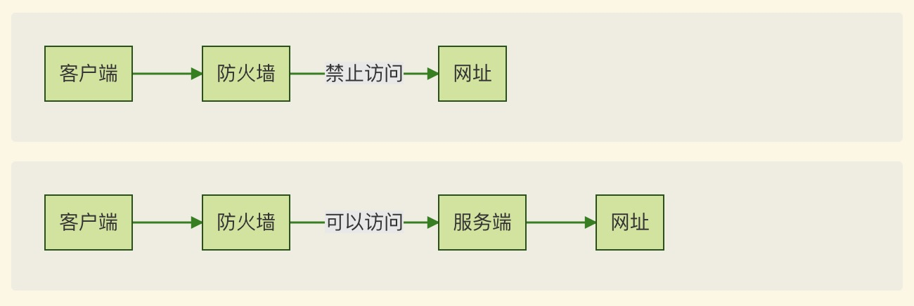

# Shadowsocks 代理

## 实现原理

1. Shadowsocks 分为客户端和服务端，客户端安装在本机，服务端安装在墙外的服务器上，注意此服务器必须是没有被封锁的
2. 安装了客户端的机器在访问网站时，会将请求发送给服务端，服务端将请求转发，收到响应后将相应回复给客户端
3. 客户端和服务端的数据传输基于 Socks5 协议，此协议是 TCP/IP 层面的网络代理协议，因此可以代理 HTTP(S) 和 SSH 等应用协议



## 代理获取

### 自建

不推荐。原因：

- 需要购买海外的服务器，本身速度快、性能合适的服务器就不容易找，或者价格较高
- 需要在服务器上搭建 Shadowsocks 服务端，且要自己运维
- 节点单一，一旦被封锁，没有其他可用节点

### 机场

推荐。原因：

- 无需运维，只从别处购买得到账号和服务
- 基本都会有香港、台湾、日本的节点，节点丰富且速度快
- 即使被封，会提供其他可用账号（国内特殊时期基本都会被封锁）

> 唯一推荐站点：[忍者云](https://renzhe.cloud/)，价格便宜，网速快，封锁期间表现较好

## 客户端

### 版本解释

- [Shadowsocks](https://github.com/shadowsocks/shadowsocks)：由 Clowwindy 开源的项目，是此系列中最初的版本，由 Python 实现，此后的软件都是基于此项目实现的。
- [ShadowsocksX](https://github.com/shadowsocks/shadowsocks-iOS/releases)：较早版本的 Shadowsocks 客户端，提供 GUI 和基本功能。
- [ShadowsocksX-NG](https://github.com/shadowsocks/ShadowsocksX-NG)：基于 ShadowsocksX 修改的客户端，增加了许多功能，是 Mac 上最常用的版本。
- [ShadowsocksR](https://github.com/WooSoftware/shadowsocksr-origin)：支持多平台的客户端，由 breakwa11 基于 Shadowsocks 项目开发，加入了混淆参数功能。
- [ShadowsocksRR](https://github.com/shadowsocksrr)：基于 ShadowsocksR 项目开发，支持订阅、节点统计以及插件等功能。
- [ClashX](https://github.com/yichengchen/clashX/releases): 支持 Shadowsocks 以及其他代理的 Mac GUI 客户端，基于规则

### 下载地址

- Mac
  - 官方：[https://github.com/shadowsocks/ShadowsocksX-NG/releases](https://github.com/shadowsocks/ShadowsocksX-NG/releases)
  - 订阅版：[https://膜.club/ssr-download/ssr-mac.dmg](https://膜.club/ssr-download/ssr-mac.dmg)
  - ClashX: [https://github.com/yichengchen/clashX/releases](https://github.com/yichengchen/clashX/releases)
- Windows 订阅版：[https://膜.club/ssr-download/ssr-win.7z](https://膜.club/ssr-download/ssr-win.7z)
- Linux：[Shadowsocks-Qt5](https://github.com/shadowsocks/shadowsocks-qt5)
- iOS 订阅版：ShadowRocket 或者 Potatso-Lite
- Android 订阅版：[https://膜.club/ssr-download/ssrr-android.apk](https://膜.club/ssr-download/ssrr-android.apk)
- Python 命令行版：[http://t.cn/RZ8XXyw](http://t.cn/RZ8XXyw)
- Electron 跨平台版：[https://github.com/erguotou520/electron-ssr](https://github.com/erguotou520/electron-ssr)
- Shadowsocks 主站推荐：[https://shadowsocks.org/en/download/clients.html](https://shadowsocks.org/en/download/clients.html)

**订阅版可以根据订阅地址，批量添加、修改节点配置。**

## 使用技巧

以下使用技巧都假定客户端、服务端可以正常连接，并且客户端默认代理端口为 1080。

### PAC 规则

PAC 即 Proxy Auto-Config 是一种网页浏览技术，其根本的 PAC 文件中包含了一个 JavaScript 函数，用来决定访问该 URL 是否需要使用代理，或选择合适的代理。通过使用 PAC，可以定制化哪些网站通过代理访问，哪些网站不通过代理访问，这也是为什么**推荐 Shadowsocks 使用 PAC 模式**的原因。当客户端启动时，此文件会挂载在本地的 Web 服务器上。

另外，我们也可以编辑 PAC 规则，以满足自己的访问需求。Shadowsocks 客户端基本都提供了此项配置，此文件中的规则最后会被写到 PAC 文件中，规则编写参考 [https://adblockplus.org/en/filter-cheatsheet](https://adblockplus.org/en/filter-cheatsheet)。

### Github 仓库克隆加速

由于众所周知的原因，Github 仓库克隆起来经常较为缓慢。考虑到 Github 克隆所使用的 HTTP(S) 和 Git 协议都是应用层协议，所以可以通过修改代理的方式，对 Github 仓库克隆进行加速。

> 代理 HTTP(S) 协议

```sh
$ git config --global http.https://github.com.proxy socks5://127.0.0.1:1080
$ git config --global https.https://github.com.proxy socks5://127.0.0.1:1080
```

> 代理 Git 协议

由于 Git 协议是基于 SSH 协议的，所以可以通过配置 `~/.ssh/config` 文件来实现代理。

**Mac 版本**

```
Host github.com
    Hostname github.com
    ProxyCommand nc -x 127.0.0.1:1080 %h %p
```

### 在终端使用代理

有时还需要在终端中使用代理，一种简单粗暴的方法是设置 `http_proxy` 和 `https_proxy` 环境变量，那么在当前终端里，所有支持这两个环境变量的软件或命令在发起 HTTP(S) 协议请求时都会使用代理。

```sh
$ export http_proxy=http://127.0.0.1:1080;export https_proxy=http://127.0.0.1:1080;
```

另一种是一些软件提供了代理的配置方法，这样就可以只配置该软件的代理，以 `curl` 命令为例，可以编辑 `~/.curlrc` 文件（或指定命令执行时的参数）来实现。

```
proxy=socks5://127.0.0.1:1080
```
